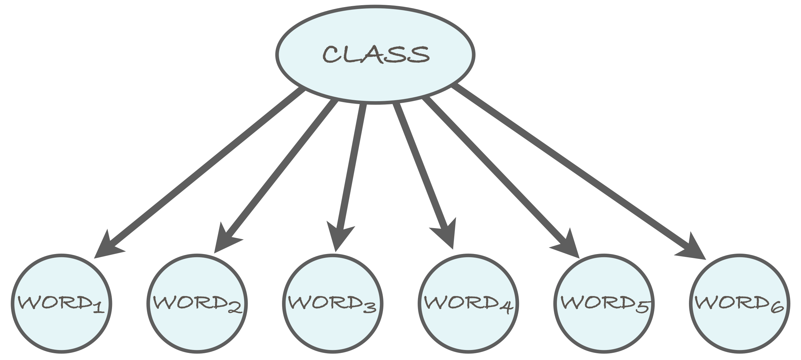
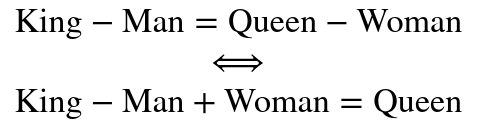
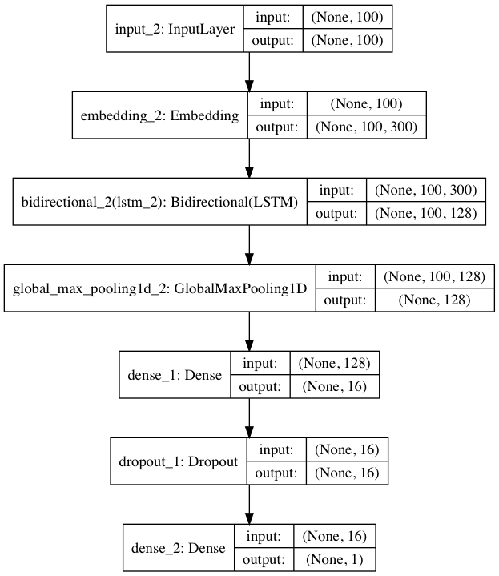
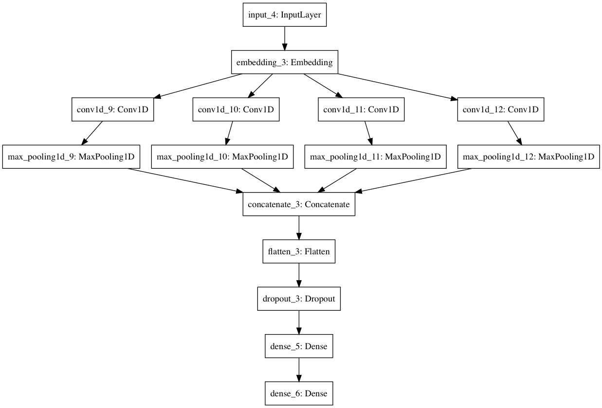

# Toxic-Comment-Classifier

## Overview
This project is a development space for the Kaggle competition to classify questions as sincere or insincere. More
information on the competition can be found [(Here)](https://www.kaggle.com/c/quora-insincere-questions-classification).
This problem will be tackled using both a simple Naive Bayes approach as well as by multiple deep learning approaches.
The goal is to compare and contrast the viability of different approaches to binary classification of text.

The approaches used are:
* Naive Bayes
* LSTM with GloVe word embeddings
* CNN with GloVe word embeddings
* TODO - Attention Network

## Repo Format
Because the competition requires that jupyter notebooks be submitted for each solution, each notebook must run from start
to finish and produce a prediction csv. All notebooks are found in the src/ directory. If you would like to run these
Notebooks yourself on a local machine, you can view the separate README in the src/ directory. Note that you'll need
a GPU to train the neural networks in a reasonable amount of time. Using a cloud instance training with an Nvidia
Tesla K80 GPU, the neural networks take ~10 minutes to train.

## Evaluation using F1 Score
There are many more 'sincere' questions than 'inscincere' in the dataset. Therefore, simply evaluating each contestant
based on accuracy (num correct/total) is a bit misleading because a model that predicts all 'sincere' will yield a 
solid accuracy, but not be very useful to the customer.

Instead, the contestants are evaluated based on F1 Score. This score better accounts for false positives and false negatives.
More information on F1 Score can be found in this [article](https://machinelearningmastery.com/classification-accuracy-is-not-enough-more-performance-measures-you-can-use/).

## Results

### Naive Bayes
The first attempt to tackle this problem uses a Naive Bayes approach. Naive Bayes relies on the assumption that all
word occurrences are independent of one another. The following is a visualization of the Naive Bayes method, which
illustrates that each word contributes its probabilities to the overall classification of the sequence, but words
are independent of one another. This is quite a strong assumption.

	

<i>Naive Bayes conditional probability</i>

Naive Bayes is often good for a rough model, but not complex enough to handle real world situations. For text 
classification specifically, Naive Bayes loses all notions of context in the text.

Using a Naive Bayes approach, I achieved a training accuracy of 0.926. While this result seems quite good, it's actually
a mediocre accuracy. The vast majority of data samples are labeled as sincere questions. Therefore, a model that
makes predictions of all '0's will fare quite well. Once submitted to the Kaggle competition, this Naive Bayes
model fared in the lowest 20% of all submissions with an F1 score of 0.526. A stronger model than a simple Naive Bayes
 model is required to tackle this problem.

### Quick Note on GloVe Word Embeddings
All of the following Neural Network architectures make use of word embeddings, specifically GloVe word embeddings. GloVe
stands for 'Global Vectors for Word Representation'. Word embeddings such as GloVe represent each word as a vector
 as opposed to a one-hot encoding. GloVe specifically is trained on a text corpus from which co-occurances statistics
 of the words are used to create these word vectors. If you would like to use GloVe word embeddings in your own work, you
can find the source files [here](https://nlp.stanford.edu/projects/glove/). Glove word vectors can be trained on your own
text corpus or you can simply use the pretrained vectors from the link above. 
The reason for using a word embedding is two-fold: space and context.
* **Space** - An intuitive approach to representing words would be a one-hot approach. That is, store a dictionary of words
with an integer assigned to each word. For each timestep (each word) in the sequence, on input neuron is 'hot' and all of
the others are 'off'. This approach, however, becomes quite cumbersome as the size of the dictionary grows. Even a modest
dictionary requires about 400,000 words. This would mean a network input size of 400,000 using a one-hot encoding. Using
 a word embedding allows us to diminish the size of the input layer to a more manageable size. Common input vectors are 
sizes 50, 100, 200, 300, resulting in less trainable parameters than a one-hot encoding. 
* **Context** - More important than space considerations, however, is the valuable contextual information retained using
word embeddings. Because the word vectors are based on statistical relationships between words, more contextual 
information is retained. A common example is found below:

	

<i>Example of word embeddings releationship</i>

In a one hot encoding, the words 'king' and 'queen' would have no relationship, however with word embeddings, this
relationship is preserved.

### Shallow LSTM with GloVe
Recurrent Neural Networks (RNN) are an excellent choice for modeling sequential data because they are able to "remember"
previous time-steps and incorporate this information into future predictions in the sequence. LSTMs are a type of RNN
that are particularly popular because they better represent long term dependencies, something quite important for a task
such as text classification.

The LSTM notebook uses GloVe word embeddings to preprocess the raw text and then uses a bidirectional LSTM Neural
Network architecture to make predictions. This results in a significantly improved F1-Score over the Naive-Bayes approach.
The F1-Score obtained from this model is 0.647 with the network architecture shown below:

	

<i>Bidirectional LSTM Architecture</i>

### CNN with GloVe
While RNNs have received a great deal of attention in recent years with the advent of the LSTM and later GRU
architectures, they have also received some healthy skepticism as of late due to their relative complexity when
compared to MLPs and CNNs. Inspired by articles such as [this](https://arxiv.org/abs/1803.01271) and 
[this](https://towardsdatascience.com/the-fall-of-rnn-lstm-2d1594c74ce0),
I decided to experiment with a CNN architecture to see if I could achieve results comparable to that of the RNN. 

After quite a bit of tinkering, this network architecture was found to achieve an F1-Score of 0.641. This was not an
improvement on the LSTM, but still proves that CNNs can achieve perform admirably at classification of sequential data.
Similar to the LSTM, a GloVe word embedding was used as the input layer.

	

<i>CNN Architecture</i>

## Built With
* [Pandas](https://pandas.pydata.org/) - Data preparation
* [scikit-learn](https://scikit-learn.org/) - Machine Learning Library
* [Keras](https://keras.io/) - Deep Learning API
* [Tensorflow](https://www.tensorflow.org/) - Deep Learning Backend
* [Glove](https://nlp.stanford.edu/projects/glove/) - Pretrained word embeddings
* [NLTK](https://www.nltk.org/) - Natural Language ToolKit
* [Seaborn](https://seaborn.pydata.org/) - Statistical data visualization
* [WordCloud](https://amueller.github.io/word_cloud/) - WordCloud generator

## Authors
* **Brian Midei** - [bmmidei](https://github.com/bmmidei)

## License
This project is licensed under the MIT License - see the [LICENSE](LICENSE) file for details

## Acknowledgments
* Kaggle competition for posing the original problem and providing data - https://www.kaggle.com/c/quora-insincere-questions-classification
* Richard Liao's [blog post](https://richliao.github.io/supervised/classification/2016/11/26/textclassifier-convolutional/) for starter code for the CNN
* Vladimir Demidov's [notebook](https://www.kaggle.com/yekenot/2dcnn-textclassifier) for the F1 Score calculation
* This great [blog post](http://debajyotidatta.github.io/nlp/deep/learning/word-embeddings/2016/11/27/Understanding-Convolutions-In-Text/) for 
understanding convolution in text classification using convolution. Excellent visuals!
